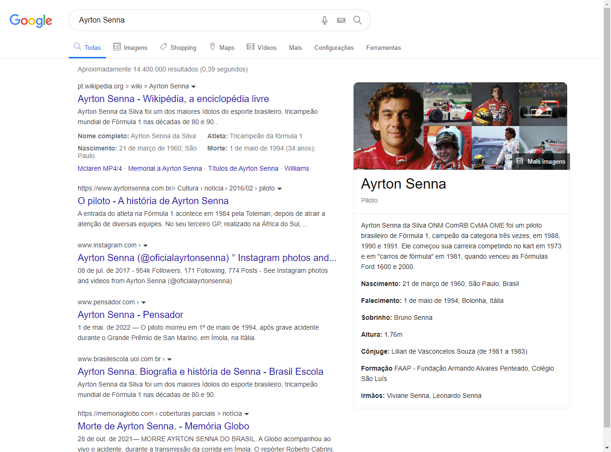

## Clone interface Google Search/Ayrton Senna
<h3>✍️Aprendizado</h3>

Projeto proposto em um curso de HTML e CSS avançado, onde pude compreender melhor o uso de classes, flexbox e manipular elementos.

🔗[Clique aqui para acessar](https://pedrodevvv.github.io/google_search_interface/)
## 🛠️Tecnologias

* HTML
* CSS
* Visual Studio Code

## 📞 Contato

📩E-mail: pedrohgs2004@gmail.com  
🌐Linkedin: https://www.linkedin.com/in/pedro-henrique-g-silva-a2100a23a/?originalSubdomain=br
